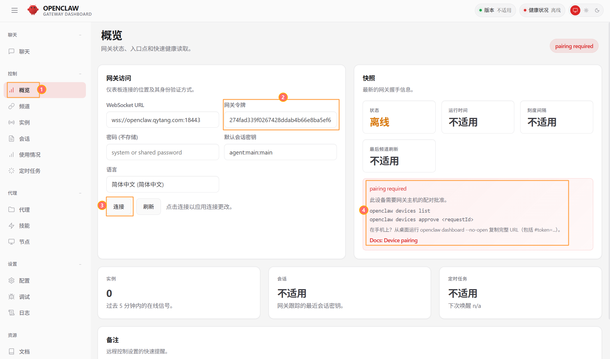
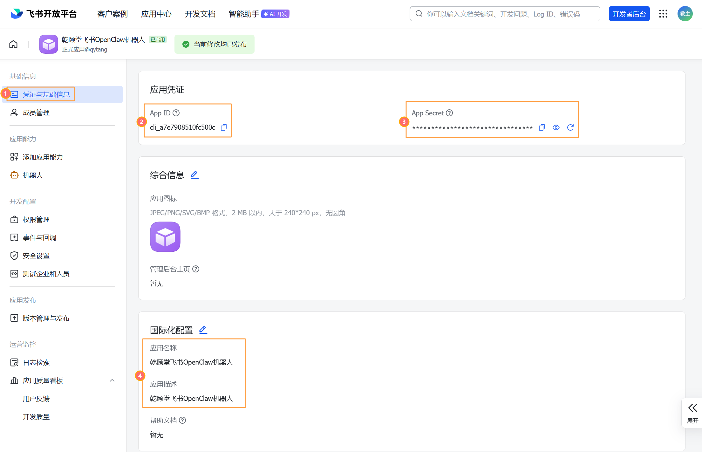
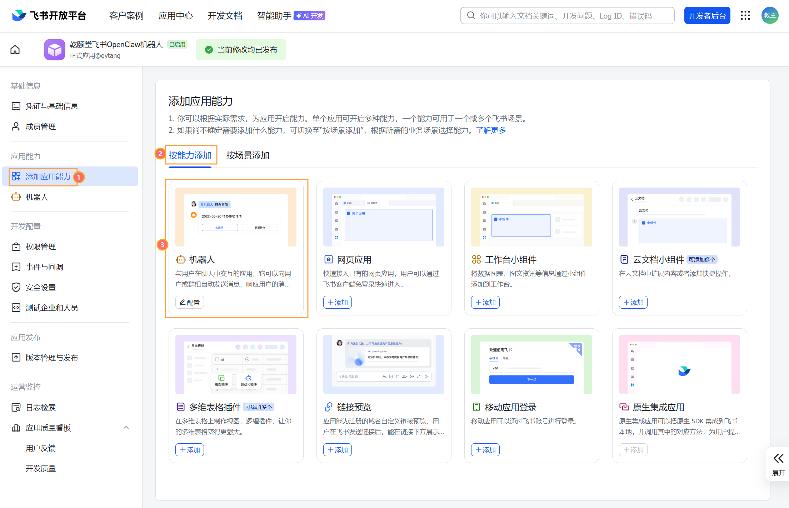
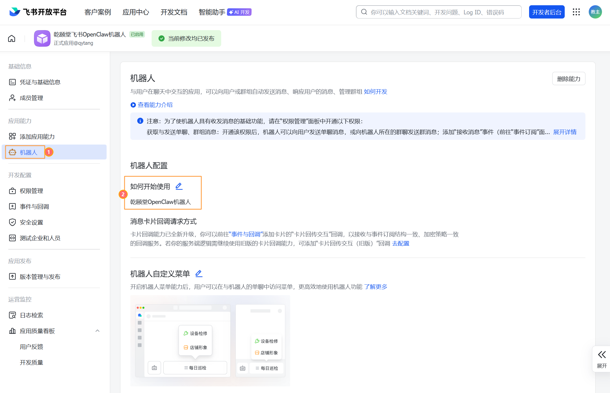
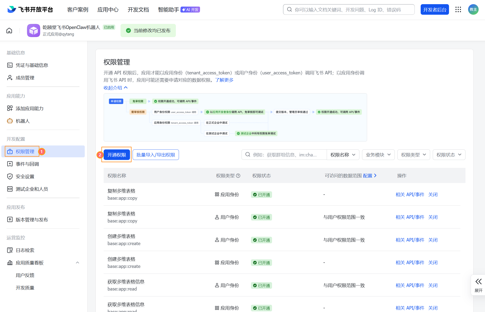
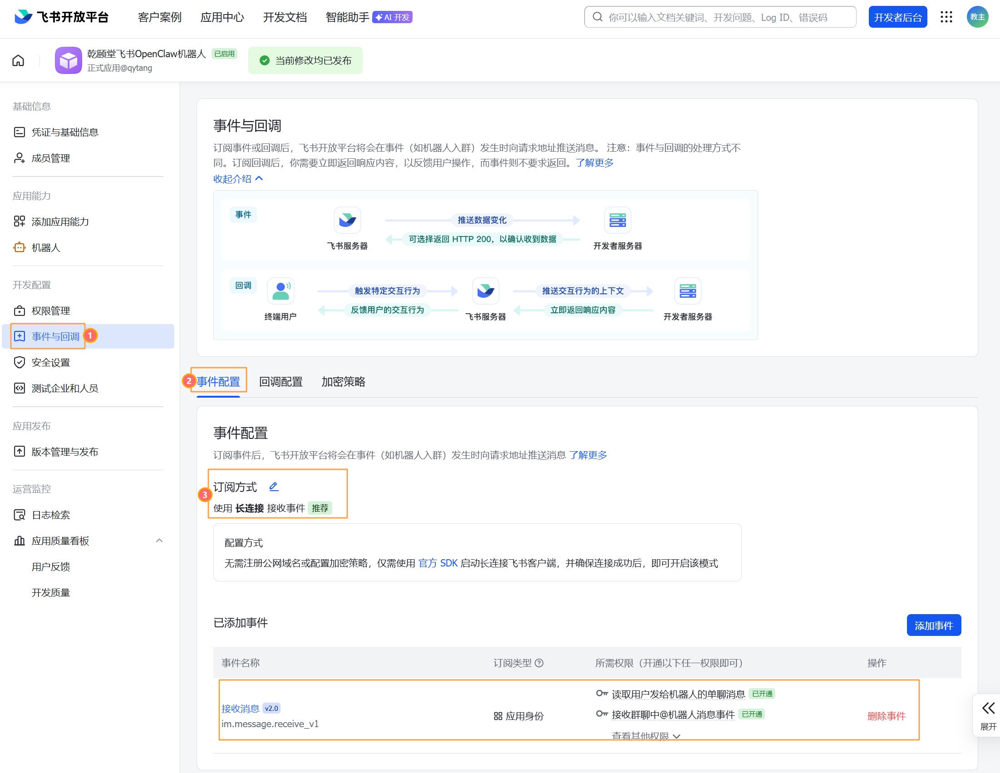
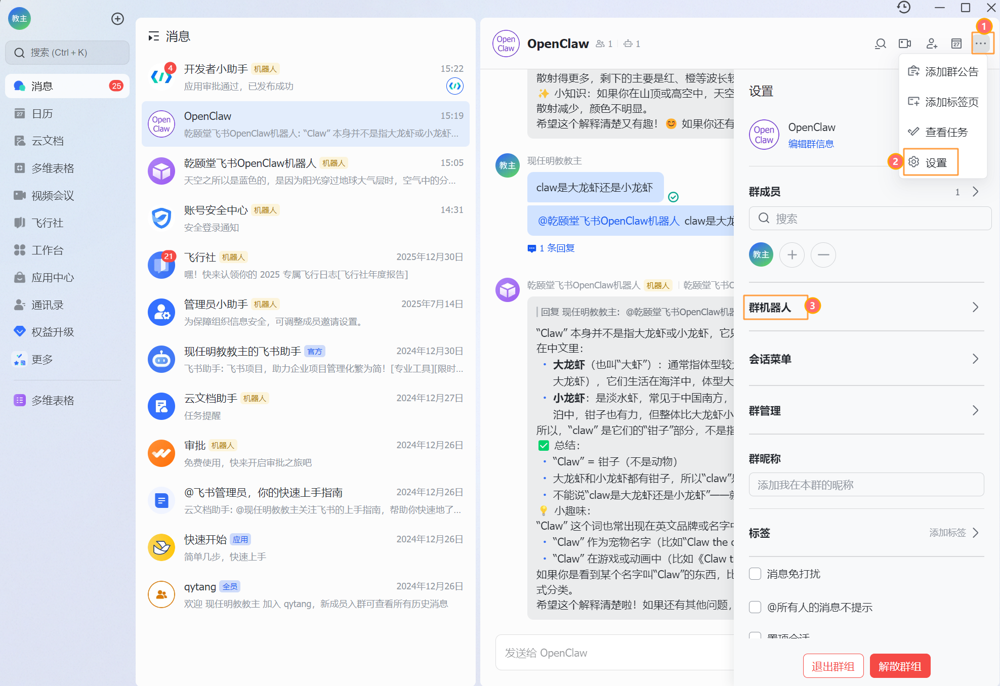
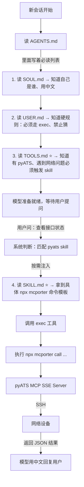

# OpenClaw 部署记录（贴贴贴版）

> 宿主机 IP: `196.21.5.228` | 访问地址: **`https://openclaw.qytang.com:18443`**
> 证书: `/qytclaw/certs/` | 项目: `/qytclaw/openclaw`
>
> **代码块说明：**
> - **▶ 执行** — 需要复制并运行的命令/脚本
> - **👁 展示** — 仅供参考，了解改动结果，不需要操作

```
浏览器 --HTTPS:18443--> [nginx容器] --HTTP--> [gateway容器:18789] --HTTPS--> [aihubmix API (minimax-m2.5)]
```

---

## 第 1 贴: Clone + 官方向导

> **▶ 执行**

```bash
cd /qytclaw
rm -rf openclaw
git clone https://github.com/openclaw/openclaw.git
cd openclaw

# 向导本身就会启动容器，volume 映射此时已生效：
#   宿主机 /root/.openclaw ←→ 容器内 /home/node/.openclaw
# 如果宿主机目录不存在，Docker 会自动创建但 owner 是 root:root，
# 容器内 node 用户（UID=1000）写不进去就报 EACCES，所以必须提前建好并赋权
mkdir -p /root/.openclaw/workspace
chown -R 1000:1000 /root/.openclaw

./docker-setup.sh
```

**若向导在验证 API 时出现 `Verification failed: fetch failed`：**  
向导里的 CLI 容器复用了 gateway 的网络；首次安装时 gateway 尚无配置会反复重启，导致 CLI 拿不到网络。改用「独立网络」跑一次 setup 即可：

```bash
# 先确保 gateway 已启动（会 crash-loop，只为创建网络）
cd /qytclaw/openclaw   # 若项目在别处则改为实际路径，如 /netclaw/openclaw
docker compose up -d openclaw-gateway

# 用独立网络跑向导（从 .env 取 token，或下面替换为实际值）
source .env 2>/dev/null || true
docker run --rm -it \
  --network openclaw_default \
  -e HOME=/home/node \
  -e TERM=xterm-256color \
  -e OPENCLAW_GATEWAY_TOKEN="${OPENCLAW_GATEWAY_TOKEN}" \
  -v /root/.openclaw:/home/node/.openclaw \
  -v /root/.openclaw/workspace:/home/node/.openclaw/workspace \
  openclaw:local \
  node dist/index.js setup
```

向导完成后 gateway 会因已有 `openclaw.json` 正常启动。

向导选项：

| 问题 | 选择 |
|---|---|
| Continue? | Yes |
| Onboarding mode | QuickStart |
| Model/auth provider | Custom Provider |
| API Base URL | `https://aihubmix.com/v1` |
| How do you want to provide this API key? | Paste API key now |
| API Key | 粘贴真实的 aihubmix 密钥（`sk-xxxx...`） |
| Endpoint compatibility | OpenAI-compatible |
| Model ID | `minimax-m2.5` |
| Verification successful. | _(自动验证 API key 是否可用)_ |
| Endpoint ID | 清空自动填入的值，**手动输入 `aihubmix`** |
| Model alias (optional) | `aihubmix` |
| Select channel (QuickStart) | Skip for now |
| Configure skills now? (recommended) | No |
| Enable hooks? | Skip for now |

> 向导结束后 gateway 已自动启动。

---

## 第 2 贴: patch `openclaw.json`（12 处）

> 向导把真实密钥直接写入 `openclaw.json`，gateway 启动时透传到 `models.json`，**不需要额外配环境变量**。
> 但向导生成的配置有 12 处需要修改（5 处 gateway + 2 处 session + 1 处命令权限 + 4 处模型），一个脚本搞定。

> **▶ 执行**

```bash
python3 << 'PYEOF'
import json, subprocess

path = '/root/.openclaw/openclaw.json'
with open(path) as f:
    cfg = json.load(f)

# ========== gateway 部分（5 处） ==========
gw = cfg['gateway']

# ① token 同步：清空后重跑向导 token 一致，但未清空时可能不同，保险起见同步
token = subprocess.check_output(
    "grep OPENCLAW_GATEWAY_TOKEN /qytclaw/openclaw/.env | cut -d= -f2",
    shell=True).decode().strip()
gw['auth']['token'] = token

# ② bind: loopback → lan（nginx 容器访问不到 loopback）
gw['bind'] = 'lan'

# ③ trustedProxies：信任 nginx 容器的代理转发头
gw['trustedProxies'] = ['172.0.0.0/8']

# ④ allowedOrigins：加上 HTTPS 域名和 IP（不加报 "origin not allowed"）
gw['controlUi']['allowedOrigins'] = [
    'http://127.0.0.1:18789',
    'http://196.21.5.228:18789',
    'https://196.21.5.228:18443',
    'https://openclaw.qytang.com:18443',
]

# ⑤ allowInsecureAuth：允许 token 认证（不强制 Tailscale）
gw['controlUi']['allowInsecureAuth'] = True

# ========== session 部分（2 处） ==========
cfg.setdefault('session', {})

# ⑥ dmScope：飞书会话隔离（避免 "Message ordering conflict"）
cfg['session']['dmScope'] = 'per-account-channel-peer'

# ⑦ resetTriggers：支持中文重置会话
cfg['session']['resetTriggers'] = ['/new', '/reset', '重置会话', '新会话']

# ========== 命令权限（1 处） ==========
# ⑫ 允许所有用户执行命令（含 resetTriggers），否则飞书发"重置会话"无效
cfg['commands'] = {"allowFrom": {"*": ["*"]}}

# ========== 模型部分（4 处） ==========
# 真正的模型配置来源是 openclaw.json，gateway 每次启动从它生成 models.json
# 直接改 models.json 会被覆盖，必须改这里
for model in cfg['models']['providers']['aihubmix'].get('models', []):
    if model['id'] == 'minimax-m2.5':
        model['reasoning'] = True          # ⑧ 向导默认 false
        model['contextWindow'] = 128000    # ⑨ 向导默认 4096，太小会报错
        model['maxTokens'] = 8192          # ⑩ 向导默认 4096
        model['compat'] = {                # ⑪ 向导不设置 compat
            "supportsDeveloperRole": False,
            "requiresToolResultName": True,
            "requiresAssistantAfterToolResult": False
        }

with open(path, 'w') as f:
    json.dump(cfg, f, indent=2)
print('✅ openclaw.json patch 完成（12 处）')
PYEOF
```

> **👁 展示** — patch 后 `openclaw.json` 中变化的部分

```json
{
  "gateway": {
    "bind": "lan",
    "trustedProxies": ["172.0.0.0/8"],
    "auth": { "token": "<与 .env 中 OPENCLAW_GATEWAY_TOKEN 相同>" },
    "controlUi": {
      "allowedOrigins": [
        "http://127.0.0.1:18789",
        "http://196.21.5.228:18789",
        "https://196.21.5.228:18443",
        "https://openclaw.qytang.com:18443"
      ],
      "allowInsecureAuth": true
    }
  },
  "session": {
    "dmScope": "per-account-channel-peer",
    "resetTriggers": ["/new", "/reset", "重置会话", "新会话"]
  },
  "commands": {
    "allowFrom": { "*": ["*"] }
  },
  "models": {
    "providers": {
      "aihubmix": {
        "apiKey": "sk-xxxx（向导直接写入真实密钥，无需改动）",
        "models": [{
          "id": "minimax-m2.5",
          "reasoning": true,
          "contextWindow": 128000,
          "maxTokens": 8192,
          "compat": {
            "supportsDeveloperRole": false,
            "requiresToolResultName": true,
            "requiresAssistantAfterToolResult": false
          }
        }]
      }
    }
  }
}
```

### patch 说明（向导没有做的 12 处）

| # | 字段 | 向导默认 | 改为 | 不改的后果 |
|---|---|---|---|---|
| ① | `gateway.auth.token` | 随机值（清空重跑一致，未清空可能不同）| 同步 .env 的值 | "unauthorized" / "too many failed attempts" |
| ② | `gateway.bind` | `loopback` | `lan` | nginx 容器访问不到 gateway |
| ③ | `gateway.trustedProxies` | 无 | `172.0.0.0/8` | nginx 转发的 `X-Real-IP` 不被信任，gateway 拿不到真实客户端 IP |
| ④ | `gateway.controlUi.allowedOrigins` | 只有 localhost | 加域名和 IP | "origin not allowed" |
| ⑤ | `gateway.controlUi.allowInsecureAuth` | 无 | `true` | token 认证被拒 |
| ⑥ | `session.dmScope` | `per-channel` | `per-account-channel-peer` | 飞书多人共用同一会话，"Message ordering conflict" |
| ⑦ | `session.resetTriggers` | `["/new", "/reset"]` | 加 `"重置会话"`, `"新会话"` | 飞书里只能发英文 `/new` 才能重置 |
| ⑫ | `commands.allowFrom` | _(无)_ | `{"*": ["*"]}` | **飞书发"重置会话"无效**（用户无命令权限） |
| ⑧ | `models..reasoning` | `false` | `true` | minimax-m2.5 支持推理模式 |
| ⑨ | `models..contextWindow` | `4096` | `128000` | **报 "context window too small"，无法使用** |
| ⑩ | `models..maxTokens` | `4096` | `8192` | 输出截断 |
| ⑪ | `models..compat` | _(无)_ | 见上方 JSON | 工具调用报错（缺 name 字段等） |

---

## 第 3 贴: 创建 nginx 配置

> nginx 反向代理，负责 HTTPS 终结，向导没有生成这部分。

> **▶ 执行**

```bash
mkdir -p /qytclaw/openclaw/nginx
cat > /qytclaw/openclaw/nginx/openclaw.conf << 'EOF'
server {
    listen 443 ssl;
    server_name openclaw.qytang.com;
    ssl_certificate     /etc/nginx/certs/server.pem;
    ssl_certificate_key /etc/nginx/certs/server-key.pem;
    location / {
        proxy_pass http://openclaw-gateway:18789;
        proxy_http_version 1.1;
        proxy_set_header Upgrade $http_upgrade;
        proxy_set_header Connection "upgrade";
        proxy_set_header Host $host;
        proxy_set_header X-Real-IP $remote_addr;
        proxy_read_timeout 86400;
    }
}
EOF
```

---

## 第 4 贴: 追加 nginx 到 docker-compose.yml + 启动

> docker-setup.sh 向导只生成了 gateway 和 cli 服务，需要手动追加 nginx。

> **▶ 执行**

```bash
if ! grep -q "openclaw-nginx" /qytclaw/openclaw/docker-compose.yml; then
cat >> /qytclaw/openclaw/docker-compose.yml << 'EOF'

  openclaw-nginx:
    image: nginx:alpine
    ports:
      - "18443:443"
    volumes:
      - ./nginx/openclaw.conf:/etc/nginx/conf.d/default.conf:ro
      - /qytclaw/certs/server.pem:/etc/nginx/certs/server.pem:ro
      - /qytclaw/certs/server-key.pem:/etc/nginx/certs/server-key.pem:ro
    depends_on:
      - openclaw-gateway
    restart: unless-stopped
EOF
fi

# 修复权限 + 重启 gateway（让 patch 生效）+ 启动 nginx
chown -R 1000:1000 /root/.openclaw
cd /qytclaw/openclaw
docker compose restart openclaw-gateway
docker compose up -d openclaw-nginx
echo "完成！访问 https://openclaw.qytang.com:18443"
```

---

## 端口

| 服务 | 端口 | 类型 |
|---|---|---|
| openclaw-gateway | 18789, 18790 | 容器 |
| openclaw-nginx | 18443 → 443 SSL | 容器 |

---

## 第 5 贴: 浏览器连接 + 批准设备

**步骤 A（终端）先做：先查看 token（等会儿 GUI 要粘贴）**

```bash
grep OPENCLAW_GATEWAY_TOKEN /qytclaw/openclaw/.env
```

**步骤 B（浏览器）再做：connect**
1. 打开 **`https://openclaw.qytang.com:18443`**
2. 页面顶部**控制概览**区域找到 Gateway Token 输入框，粘贴上一步查到的 token，点连接



3. 显示 **"pairing required"** → 正常，立刻执行步骤 C（5 分钟内）

**步骤 C（终端）最后做：approve（5 分钟内）**

```bash
docker exec openclaw-openclaw-gateway-1 node dist/index.js devices approve --latest \
  --url ws://127.0.0.1:18789 \
  --token $(grep OPENCLAW_GATEWAY_TOKEN /qytclaw/openclaw/.env | cut -d= -f2)
```

批准后浏览器自动重连，显示聊天界面。

---

## 飞书 Channel 接入

### 阶段一：飞书开放平台建应用

访问 [飞书开放平台](https://open.feishu.cn/app)

**① 创建企业自建应用**
- 点击「创建企业自建应用」→ 填写名称和描述

**② 复制凭证**
- 凭证与基础信息 → 复制 **App ID** 和 **App Secret**



**③ 开启机器人能力**
- 应用能力 → 机器人 → 开启



**④ 配置机器人描述**
- 机器人页面填写机器人的描述信息



**⑤ 配置权限**
- 权限管理 → 逐个搜索并开通：



| 权限标识 | 说明 |
|---|---|
| `im:message` | 发送和接收消息（**必须**） |
| `im:message:send_as_bot` | 以机器人身份发消息（**必须**） |
| `im:message.p2p_msg:readonly` | 读取私聊消息 |
| `im:message.group_at_msg:readonly` | 读取群 @ 消息 |
| `im:message:readonly` | 读取消息 |
| `im:chat.members:bot_access` | 获取群成员信息 |
| `im:resource` | 获取消息中的资源文件 |

> ⚠️ 不开 `im:message` + `im:message:send_as_bot` 机器人收到消息但无法回复

**⑤ 先发布一个版本（第一次）**
- 版本管理与发布 → 创建版本 → 申请发布 → 等管理员审批

---

### 阶段二：OpenClaw 配置飞书 channel

```bash
cd /qytclaw/openclaw
docker compose run --rm -it openclaw-cli plugins install ./extensions/feishu
docker compose run --rm -it openclaw-cli channels add
```

向导选项：

| 问题 | 选择 |
|---|---|
| Select a channel | Feishu/Lark (飞书) |
| Enter Feishu App ID | `cli_a7e7908510fc500c` |
| Enter Feishu App Secret | （步骤②复制的值） |
| Which Feishu domain? | Feishu (feishu.cn) - China |
| Group chat policy | Open - respond in all groups (requires mention) |
| Configure DM access policies? | Yes |
| Feishu DM policy | Open (public inbound DMs) |
| Add display names for these accounts? (optional) | Yes |
| feishu account name (default) | 输入 `feishu` |
| Bind configured channel accounts to agents now? | Yes |
| Route feishu account "default" to agent | main (default) |

向导完成后 gateway 自动加载飞书 channel，无需重启。

---

### 阶段三：回飞书开放平台配置事件订阅

> ⚠️ 必须 gateway 已在线（WebSocket client started），否则报"应用未建立长连接"

- 事件与回调 → 事件订阅 → **使用长连接接收事件** → 添加事件 `im.message.receive_v1` → 保存



**然后重新发版（权限和事件变更后必须重新发版才生效）：**
- 版本管理与发布 → 创建新版本 → 申请发布

---

### 阶段四：把机器人加入群

- 在飞书里搜机器人名称（私信测试）
- 加入群：群设置 → **群机器人** → 添加机器人 → 搜索应用名



> ⚠️ "添加成员"搜不到机器人，必须走"群机器人"入口

---

### 限制只响应指定群（可选）

先拿群 ID：群里 @机器人发一条消息，然后看日志：

```bash
docker compose logs -f openclaw-gateway 2>&1 | grep "oc_"
```

日志格式说明（实际输出示例）：

```
# 私聊消息（p2p）
feishu[default]: received message from ou_bd168983cc90f1dc967288dc2f4ee49d in oc_12df005d05dab0e49a0ea2a5cb7beed6 (p2p)

# 群聊消息（group）
feishu[default]: received message from ou_bd168983cc90f1dc967288dc2f4ee49d in oc_19f4480d995fd75de4f3b45eff7445e1 (group)
feishu[default]: dispatching to agent (session=agent:main:feishu:group:oc_19f4480d995fd75de4f3b45eff7445e1)
```

| 字段 | 说明 |
|---|---|
| `ou_xxx` | 发消息的用户 open_id |
| `oc_xxx (p2p)` | 私聊的 session ID，**不是群 ID**，限制群用不了 |
| `oc_xxx (group)` | 真正的群 chat_id，**限制群时用这个** |

拿到群的 `oc_xxx` 后配置：

```bash
python3 << 'PYEOF'
import json
path = '/root/.openclaw/openclaw.json'
with open(path) as f:
    cfg = json.load(f)
cfg['channels']['feishu']['groupPolicy'] = 'allowlist'
cfg['channels']['feishu']['groupAllowFrom'] = ['oc_这里填群ID']
with open(path, 'w') as f:
    json.dump(cfg, f, indent=2)
print('完成')
PYEOF
cd /qytclaw/openclaw && docker compose restart openclaw-gateway
```

---

## pyATS MCP SSE 集成（终版）

> 路径: `/qytclaw/pyats-mcp/`
> SSE 地址: `http://pyats-mcp:8765/sse`（容器间）/ `http://localhost:8765/sse`（宿主机）

### 所有坑（按踩坑顺序）

| 问题 | 原因 | 解决 |
|---|---|---|
| `No module named 'pkg_resources'` | setuptools≥74 移除了独立 `pkg_resources`，pyATS Cython 扩展依赖它 | Dockerfile 最后一步 `pip install setuptools==67.8.0` |
| gateway 容器无法运行 `docker run` | gateway 容器内没有 docker CLI 可执行文件 | 改为独立 SSE HTTP 服务，不依赖 Docker |
| `FastMCP.run()` 不支持 `host`/`port` 参数 | mcp 1.26.0 的 `run()` 不接受这两个参数 | 在 `FastMCP()` 初始化时传入 `host=`/`port=` |
| `Invalid Host header` (421) | mcp 默认开启 DNS rebinding 保护，拒绝非 localhost Host | `FastMCP(..., transport_security=TransportSecuritySettings(enable_dns_rebinding_protection=False))` |
| `mcporter` 报 HTTP endpoints 需要 `--allow-http` | mcporter 对 HTTP（非 HTTPS）URL 默认拒绝 | 调用时加 `--allow-http` |
| 模型不调用 exec，说"没权限" | OpenClaw skill 按需注入，模型如果没触发 skill 就不知道具体命令 → 自己猜 → 失败 | `TOOLS.md` 写行为规则（禁止猜测、必须触发 skill）；`SKILL.md` 保留全部命令，触发时注入 |
| 飞书能力正常但不调 pyATS | `AGENTS.md` Every Session 必读列表没有 `TOOLS.md`，飞书场景不读它 | 在 AGENTS.md 第 3 条加 `Read TOOLS.md` |
| GUI/飞书仍用英文回复 | 语言约束没写进会话必读文件或旧 session 沿用旧上下文 | 在 `SOUL.md`/`USER.md`/`AGENTS.md`/`SKILL.md` 写入“默认中文回复”，重启 gateway，并用新会话验证 |
| 文档中嵌套代码块导致渲染错乱 | 在 openclaw.md 里内嵌 SKILL/TOOLS 内容会出现 ``` 嵌套提前闭合 | 把 `SKILL.md`/`TOOLS.md`/`AGENTS.md`/`USER.md` 放入 `templates/`，文档只保留 `cp` 命令 |
| 模型误用不通用命令（如某些 IOS-XE 不支持的语法） | 不同版本/平台命令差异 | 在 `TOOLS.md` 增加“失败最多重试 5 次、换命令思路”的规则；失败只回显工具 error/输出不猜原因 |
| 不应固化设备/接口/IP/计数器等数据 | 复盘时容易把实时信息写进文档/模板 | 在 `USER.md`/`TOOLS.md`/`SKILL.md` 写入“禁止在文档/记录固化这些数据”，需要时每次实时调用获取 |
| 飞书加完 skill 后仍执行本地 `pyats` 命令 | 之前测试普通对话已创建 session，旧上下文没有 TOOLS.md/SKILL.md | B-5 重启后，在飞书发"重置会话"清除旧上下文 |

---

### 第 A 贴：构建 pyATS MCP SSE 镜像

目录: `/qytclaw/pyats-mcp/`

```
/qytclaw/pyats-mcp/
├── pyats_sse_server.py   ← FastMCP SSE 服务（7 个工具）
├── Dockerfile
├── docker-compose.yml    ← 加入 openclaw_default 网络
├── testbed.yaml          ← 已内置进镜像
└── templates/            ← OpenClaw 配置模板（重建时 cp 到 ~/.openclaw/）
    ├── SKILL.md          ← pyATS skill 定义
    ├── TOOLS.md          ← 模型必读的工具指令
    └── AGENTS.md         ← 修复了 TOOLS.md 必读
```

所有文件如下：

#### `Dockerfile`

```dockerfile
FROM python:3.10-slim

LABEL description="pyATS MCP Server - SSE transport for OpenClaw"

RUN apt-get update && apt-get install --no-install-recommends -y \
        openssh-client \
        build-essential \
        libssl-dev \
        libffi-dev \
        libxml2-dev \
        libxslt1-dev \
        zlib1g-dev \
    && apt-get clean && rm -rf /var/lib/apt/lists/*

WORKDIR /app

RUN pip install --no-cache-dir --upgrade pip setuptools wheel

RUN pip install --no-cache-dir \
        backports.ssl \
        backports.ssl-match-hostname \
        tftpy \
        ncclient \
        f5-icontrol-rest

RUN pip install --no-cache-dir \
        pydantic \
        python-dotenv \
        "mcp[cli]" \
        pyats[full]==25.2.0

# pyATS Cython 扩展依赖 pkg_resources（setuptools>=74 已移除独立包）
RUN pip install --no-cache-dir "setuptools==67.8.0"

COPY pyats_sse_server.py .
COPY testbed.yaml .

EXPOSE 8765

ENTRYPOINT ["python", "pyats_sse_server.py"]
```

#### `docker-compose.yml`

```yaml
services:
  pyats-mcp:
    build: .
    image: pyats-mcp-sse:latest
    container_name: pyats-mcp
    environment:
      PYATS_TESTBED_PATH: /app/testbed.yaml
      MCP_HOST: 0.0.0.0
      MCP_PORT: "8765"
    ports:
      - "8765:8765"
    networks:
      - openclaw_default
    restart: unless-stopped
    healthcheck:
      test: ["CMD", "python3", "-c", "import urllib.request; urllib.request.urlopen('http://localhost:8765/sse', timeout=3)"]
      interval: 30s
      timeout: 10s
      retries: 3
      start_period: 15s

networks:
  openclaw_default:
    external: true
```

#### `pyats_sse_server.py`（完整）

```python
import os
import re
import string
import sys
import json
import logging
import textwrap
from pyats.topology import loader
from genie.libs.parser.utils import get_parser
from dotenv import load_dotenv
from typing import Dict, Any
import asyncio
from functools import partial
from mcp.server.fastmcp import FastMCP

logging.basicConfig(level=logging.INFO, format="%(asctime)s - %(name)s - %(levelname)s - %(message)s")
logger = logging.getLogger("PyatsSSEMCPServer")

load_dotenv()
TESTBED_PATH = os.getenv("PYATS_TESTBED_PATH", "/app/testbed.yaml")

if not os.path.exists(TESTBED_PATH):
    logger.critical(f"❌ testbed 文件不存在: {TESTBED_PATH}")
    sys.exit(1)

logger.info(f"✅ 使用 testbed: {TESTBED_PATH}")

HOST = os.getenv("MCP_HOST", "0.0.0.0")
PORT = int(os.getenv("MCP_PORT", "8765"))

from mcp.server.transport_security import TransportSecuritySettings

# ---------- pyATS 核心函数 ----------

def _get_device(device_name: str):
    testbed = loader.load(TESTBED_PATH)
    device = testbed.devices.get(device_name)
    if not device:
        raise ValueError(f"设备 '{device_name}' 在 testbed 中不存在")
    if not device.is_connected():
        logger.info(f"连接 {device_name}...")
        device.connect(connection_timeout=120, learn_hostname=True, log_stdout=False, mit=True)
        logger.info(f"已连接 {device_name}")
    return device

def _disconnect(device):
    if device and device.is_connected():
        try:
            device.disconnect()
        except Exception as e:
            logger.warning(f"断开 {device.name} 失败: {e}")

def clean_output(output: str) -> str:
    ansi = re.compile(r'\x1B(?:[@-Z\\-_]|\[[0-?]*[ -/]*[@-~])')
    return ''.join(c for c in ansi.sub('', output) if c in string.printable)

def _list_devices() -> Dict[str, Any]:
    try:
        testbed = loader.load(TESTBED_PATH)
        devices = {}
        for name, dev in testbed.devices.items():
            conn = {}
            if hasattr(dev, 'connections'):
                for cname, cinfo in dev.connections.items():
                    if hasattr(cinfo, 'ip'):
                        conn[cname] = {"ip": str(cinfo.ip), "protocol": getattr(cinfo, 'protocol', 'ssh')}
            devices[name] = {
                "type": getattr(dev, 'type', 'unknown'),
                "os": getattr(dev, 'os', 'unknown'),
                "platform": getattr(dev, 'platform', 'unknown'),
                "connections": conn,
            }
        return {"status": "success", "device_count": len(devices), "devices": devices}
    except Exception as e:
        return {"status": "error", "error": str(e)}

def _execute_show(device_name: str, command: str) -> Dict[str, Any]:
    disallowed = ['|', 'include', 'exclude', 'begin', '>', '<', 'erase', 'reload', 'write', 'copy', 'delete']
    cmd_lower = command.lower().strip()
    if not cmd_lower.startswith("show"):
        return {"status": "error", "error": f"'{command}' 不是 show 命令"}
    for part in cmd_lower.split():
        if part in disallowed:
            return {"status": "error", "error": f"命令包含不允许的词 '{part}'"}
    device = None
    try:
        device = _get_device(device_name)
        try:
            return {"status": "completed", "device": device_name, "output": device.parse(command)}
        except Exception:
            return {"status": "completed_raw", "device": device_name, "output": device.execute(command)}
    except Exception as e:
        return {"status": "error", "error": str(e)}
    finally:
        _disconnect(device)

def _execute_config(device_name: str, config_commands: str) -> Dict[str, Any]:
    if "erase" in config_commands.lower():
        return {"status": "error", "error": "检测到危险命令 (erase)，已拒绝"}
    device = None
    try:
        device = _get_device(device_name)
        cleaned = textwrap.dedent(config_commands.strip())
        output = device.configure(cleaned)
        return {"status": "success", "device": device_name, "output": output}
    except Exception as e:
        return {"status": "error", "error": str(e)}
    finally:
        _disconnect(device)

def _execute_running_config(device_name: str) -> Dict[str, Any]:
    device = None
    try:
        device = _get_device(device_name)
        device.enable()
        raw = device.execute("show run brief")
        return {"status": "completed_raw", "device": device_name, "output": clean_output(raw)}
    except Exception as e:
        return {"status": "error", "error": str(e)}
    finally:
        _disconnect(device)

def _execute_logging(device_name: str) -> Dict[str, Any]:
    device = None
    try:
        device = _get_device(device_name)
        raw = device.execute("show logging last 250")
        return {"status": "completed_raw", "device": device_name, "output": raw}
    except Exception as e:
        return {"status": "error", "error": str(e)}
    finally:
        _disconnect(device)

def _execute_ping(device_name: str, command: str) -> Dict[str, Any]:
    if not command.lower().strip().startswith("ping"):
        return {"status": "error", "error": f"'{command}' 不是 ping 命令"}
    device = None
    try:
        device = _get_device(device_name)
        try:
            return {"status": "completed", "device": device_name, "output": device.parse(command)}
        except Exception:
            return {"status": "completed_raw", "device": device_name, "output": device.execute(command)}
    except Exception as e:
        return {"status": "error", "error": str(e)}
    finally:
        _disconnect(device)

def _execute_linux(device_name: str, command: str) -> Dict[str, Any]:
    device = None
    try:
        testbed = loader.load(TESTBED_PATH)
        if device_name not in testbed.devices:
            return {"status": "error", "error": f"设备 '{device_name}' 不存在"}
        device = testbed.devices[device_name]
        if not device.is_connected():
            device.connect()
        if ">" in command or "|" in command:
            command = f'sh -c "{command}"'
        try:
            if get_parser(command, device):
                output = device.parse(command)
            else:
                raise ValueError()
        except Exception:
            output = device.execute(command)
        return {"status": "completed", "device": device_name, "output": output}
    except Exception as e:
        return {"status": "error", "error": str(e)}
    finally:
        if device and device.is_connected():
            try:
                device.disconnect()
            except Exception:
                pass

# ---------- MCP 工具注册 ----------

mcp = FastMCP(
    "pyATS Network Automation Server",
    host=HOST,
    port=PORT,
    transport_security=TransportSecuritySettings(
        enable_dns_rebinding_protection=False
    ),
)

@mcp.tool()
async def pyats_list_devices() -> str:
    """列出 testbed 中所有可用网络设备及连接信息，无需任何参数。"""
    loop = asyncio.get_event_loop()
    result = await loop.run_in_executor(None, _list_devices)
    return json.dumps(result, indent=2)

@mcp.tool()
async def pyats_run_show_command(device_name: str, command: str) -> str:
    """
    在 Cisco IOS/NX-OS 设备上执行 show 命令。
    Args:
        device_name: testbed 中的设备名
        command: show 命令，如 'show ip interface brief'
    """
    loop = asyncio.get_event_loop()
    result = await loop.run_in_executor(None, partial(_execute_show, device_name, command))
    return json.dumps(result, indent=2)

@mcp.tool()
async def pyats_configure_device(device_name: str, config_commands: str) -> str:
    """
    向设备下发配置命令（多行用 \\n 分隔）。
    Args:
        device_name: testbed 中的设备名
        config_commands: 配置命令
    """
    loop = asyncio.get_event_loop()
    result = await loop.run_in_executor(None, partial(_execute_config, device_name, config_commands))
    return json.dumps(result, indent=2)

@mcp.tool()
async def pyats_show_running_config(device_name: str) -> str:
    """
    获取设备 running configuration。
    Args:
        device_name: testbed 中的设备名
    """
    loop = asyncio.get_event_loop()
    result = await loop.run_in_executor(None, partial(_execute_running_config, device_name))
    return json.dumps(result, indent=2)

@mcp.tool()
async def pyats_show_logging(device_name: str) -> str:
    """
    获取设备最近系统日志。
    Args:
        device_name: testbed 中的设备名
    """
    loop = asyncio.get_event_loop()
    result = await loop.run_in_executor(None, partial(_execute_logging, device_name))
    return json.dumps(result, indent=2)

@mcp.tool()
async def pyats_ping_from_network_device(device_name: str, command: str) -> str:
    """
    从设备发起 ping 测试。
    Args:
        device_name: testbed 中的设备名
        command: ping 命令，如 'ping <TARGET_IP>'
    """
    loop = asyncio.get_event_loop()
    result = await loop.run_in_executor(None, partial(_execute_ping, device_name, command))
    return json.dumps(result, indent=2)

@mcp.tool()
async def pyats_run_linux_command(device_name: str, command: str) -> str:
    """
    在 Linux 设备上执行命令。
    Args:
        device_name: testbed 中的 Linux 设备名
        command: Linux 命令，如 'ifconfig'
    """
    loop = asyncio.get_event_loop()
    result = await loop.run_in_executor(None, partial(_execute_linux, device_name, command))
    return json.dumps(result, indent=2)

if __name__ == "__main__":
    logger.info(f"🚀 pyATS SSE MCP Server 启动 → http://{HOST}:{PORT}/sse")
    mcp.run(transport="sse")
```

#### `testbed.yaml`（内置进镜像）

> 出于“不要记录具体设备/IP/账号密码”的要求，此文档不内嵌 `testbed.yaml` 内容。  
> **以实际文件为准**：`/qytclaw/pyats-mcp/testbed.yaml`

构建并启动：

> **▶ 执行**

```bash
cd /qytclaw/pyats-mcp
docker compose up -d

# 验证 SSE 端点（从宿主机）
timeout 5 curl -N -s http://localhost:8765/sse
# 期望输出:
# event: endpoint
# data: /messages/?session_id=xxxx

# 验证从 gateway 容器可达
docker exec openclaw-openclaw-gateway-1 timeout 5 curl -s http://pyats-mcp:8765/sse
# 期望同上（不报 Invalid Host header）

# 完整功能测试
docker exec openclaw-openclaw-gateway-1 \
  npx --yes mcporter@latest call http://pyats-mcp:8765/sse \
  pyats_list_devices --allow-http --output json
```

---

### 第 B 贴：配置 OpenClaw

> **为什么 `cp` 到 `/root/.openclaw/` 就等于放进了容器？**
>
> `docker-setup.sh` 向导自动在 `.env` 里设置了两个 volume 映射：
>
> | 宿主机路径 | 容器内路径 | 说明 |
> |---|---|---|
> | `/root/.openclaw/` | `/home/node/.openclaw/` | 配置目录（含 `openclaw.json`、`exec-approvals.json` 等） |
> | `/root/.openclaw/workspace/` | `/home/node/.openclaw/workspace/` | 工作区（含 `AGENTS.md`、`TOOLS.md`、`skills/` 等） |
>
> 所以在宿主机执行 `cp xxx /root/.openclaw/workspace/TOOLS.md`，容器内立刻就能看到 `/home/node/.openclaw/workspace/TOOLS.md`——它们是**同一个文件**，不需要 `docker cp`。
>
> `chown 1000:1000` 是因为容器内以 `node` 用户（UID=1000）运行，宿主机 root 创建的文件默认 owner 是 `root:root`，容器内的 node 进程读不到，必须改权限。

#### B-1. openclaw.json 增加 tools + skills 配置

> 向导生成的 `openclaw.json` 只有 models、gateway 等配置，没有 `tools` 和 `skills`。
> 下面的脚本往里面加两个顶级节点，让 OpenClaw 知道"有 exec 工具可以用"和"去哪里扫描 skill"。

> **▶ 执行**

```python
python3 << 'EOF'
import json
path = '/root/.openclaw/openclaw.json'
with open(path) as f:
    cfg = json.load(f)

# exec 工具：在 gateway 容器内运行，不需要审批
cfg['tools'] = {
    "exec": {
        "host": "gateway",
        "security": "full",
        "ask": "off"
    }
}

# skills：扫描 workspace/skills 目录
cfg['skills'] = {
    "load": {
        "extraDirs": ["/home/node/.openclaw/workspace/skills"],
        "watch": True
    }
}

with open(path, 'w') as f:
    json.dump(cfg, f, indent=2)
print("完成")
EOF
```

> **👁 展示** — 脚本执行后 `openclaw.json` 新增的部分

```json
{
  "tools": {
    "exec": {
      "host": "gateway",
      "security": "full",
      "ask": "off"
    }
  },
  "skills": {
    "load": {
      "extraDirs": ["/home/node/.openclaw/workspace/skills"],
      "watch": true
    }
  }
}
```

| 字段 | 含义 | 不配的后果 |
|---|---|---|
| `tools.exec.host` = `gateway` | exec 工具在 gateway 容器内执行（能访问 Docker 网络内的 pyats-mcp） | exec 尝试在沙箱或其他环境运行，找不到 pyats-mcp |
| `tools.exec.security` = `full` | 不限制可执行的命令 | 只能执行白名单内的命令 |
| `tools.exec.ask` = `off` | 不弹窗审批 | 每次 exec 都要人工点批准 |
| `skills.load.extraDirs` | 告诉系统去 `workspace/skills/` 目录扫描 SKILL.md | 系统不知道有 pyats skill |
| `skills.load.watch` = `true` | 文件变化时自动重新加载 skill | 修改 SKILL.md 后需要重启 gateway 才生效 |

#### B-2. exec-approvals.json

> 这个文件控制 `exec` 工具的权限。默认配置下，模型每次调 `exec` 都会弹窗让你审批，
> 这对 pyATS 调用很不现实（一次查询可能执行多条命令）。下面的脚本把 main agent 设为"全部放行"。

> **▶ 执行**

```python
python3 << 'EOF'
import json, os
path = '/root/.openclaw/exec-approvals.json'
if os.path.exists(path):
    with open(path) as f:
        cfg = json.load(f)
else:
    cfg = {"version": 1, "defaults": {"security": "allowlist", "ask": "on-miss", "askFallback": "deny", "autoAllowSkills": True}}

cfg['agents'] = {
    "main": {
        "security": "full",
        "ask": "off",
        "askFallback": "allow",
        "autoAllowSkills": True
    }
}

with open(path, 'w') as f:
    json.dump(cfg, f, indent=2)
print("完成")
EOF
```

> **👁 展示** — 脚本执行后 `exec-approvals.json` 的完整内容

```json
{
  "version": 1,
  "socket": {
    "path": "/home/node/.openclaw/exec-approvals.sock",
    "token": "<自动生成，每次不同>"
  },
  "defaults": {
    "security": "allowlist",
    "ask": "on-miss",
    "askFallback": "deny",
    "autoAllowSkills": true
  },
  "agents": {
    "main": {
      "security": "full",
      "ask": "off",
      "askFallback": "allow",
      "autoAllowSkills": true
    }
  }
}
```

| 字段 | 默认值 | 改为 | 含义 |
|---|---|---|---|
| `agents.main.security` | _(无 agents 节)_ | `full` | main agent 可执行任意命令，不限于白名单 |
| `agents.main.ask` | _(继承 defaults: on-miss)_ | `off` | 不弹窗审批，直接执行 |
| `agents.main.askFallback` | _(继承 defaults: deny)_ | `allow` | 如果无法弹窗（如飞书），默认放行而不是拒绝 |
| `agents.main.autoAllowSkills` | _(继承 defaults: true)_ | `true` | skill 注册的命令自动放行 |

#### B-2.5. 覆盖写 USER.md（强制 pyATS 必须走工具）

> USER.md 每次 session 必读，用来避免模型“不调用 exec 就直接编原因”。  
> 查看源文件: `cat /qytclaw/pyats-mcp/templates/USER.md`

> **▶ 执行**

```bash
cp /qytclaw/pyats-mcp/templates/USER.md /root/.openclaw/workspace/USER.md
chown 1000:1000 /root/.openclaw/workspace/USER.md
```

#### B-3. 创建 pyATS skill（从模板复制）

> 模板文件位于 `/qytclaw/pyats-mcp/templates/`，含嵌套 markdown 代码块，不在此文档内嵌入。
> 查看源文件: `cat /qytclaw/pyats-mcp/templates/SKILL.md`

> **▶ 执行**

```bash
mkdir -p /root/.openclaw/workspace/skills/pyats
cp /qytclaw/pyats-mcp/templates/SKILL.md /root/.openclaw/workspace/skills/pyats/SKILL.md
chown 1000:1000 /root/.openclaw/workspace/skills/pyats/SKILL.md
```

#### B-4. 覆盖写 TOOLS.md（从模板复制，关键！模型每次必读）

> TOOLS.md 定义了 pyATS 的**行为规则**（禁止猜测、必须触发 skill、失败重试等），模型读到后才知道遇到网络设备问题时必须走工具。
> 具体的 `npx mcporter` 命令**不在** TOOLS.md 里，而是在 SKILL.md 里（按需注入，节省 token）。
> 查看源文件: `cat /qytclaw/pyats-mcp/templates/TOOLS.md`

> **▶ 执行**

```bash
cp /qytclaw/pyats-mcp/templates/TOOLS.md /root/.openclaw/workspace/TOOLS.md
chown 1000:1000 /root/.openclaw/workspace/TOOLS.md
```

#### B-4.5. 修复 AGENTS.md（让飞书也读 TOOLS.md）

> 默认 `AGENTS.md` 的 "Every Session" 必读列表不含 `TOOLS.md`，飞书场景模型不知道有 pyATS。
> 模板已修复此问题，直接覆盖即可。
> 查看源文件: `cat /qytclaw/pyats-mcp/templates/AGENTS.md`

> **▶ 执行**

```bash
cp /qytclaw/pyats-mcp/templates/AGENTS.md /root/.openclaw/workspace/AGENTS.md
chown 1000:1000 /root/.openclaw/workspace/AGENTS.md
```

#### B-5. 修复权限 + 重启 gateway + 重置飞书会话

> **▶ 执行**

```bash
chown -R 1000:1000 /root/.openclaw
cd /qytclaw/openclaw && docker compose restart openclaw-gateway

# 验证 skill 已就绪
docker compose run --rm openclaw-cli skills 2>&1 | grep pyats
# 期望: ✓ ready  🌐 pyats
```

> ⚠️ 如果之前已经用飞书测试过普通对话，旧 session 上下文里没有 TOOLS.md 和 SKILL.md，模型会继续用旧知识回答（比如尝试执行本地 `pyats` 命令）。
>
> **在飞书聊天里发送 `重置会话` 或 `新会话`** 即可清除旧上下文，下一条消息就是全新 session，会从头读取所有配置文件。
>
> （第 2 贴的 patch 脚本已配置了 `session.resetTriggers`，支持这四个触发词：`/new`、`/reset`、`重置会话`、`新会话`）

---

### 架构总览

```
飞书用户
  → OpenClaw gateway（容器）
      → exec 工具（gateway 进程内）
          → npx mcporter@latest call http://pyats-mcp:8765/sse <工具> --allow-http
              → pyats-mcp 容器（SSE MCP Server，同一 Docker 网络）
                  → SSH → testbed.yaml 中的网络设备
```

### 重头来的完整顺序

> 前提：已完成第 1-5 贴（OpenClaw + nginx + 飞书）

```bash
# 1. 构建并启动 pyATS MCP（第 A 贴）
cd /qytclaw/pyats-mcp && docker compose up -d --build

# 2. 验证 SSE
timeout 5 curl -N -s http://localhost:8765/sse | head -2
# 期望: event: endpoint

# 3. 配置 openclaw.json 加 tools + skills（B-1 的 python3 脚本）

# 4. 配置 exec-approvals.json（B-2 的 python3 脚本）

# 5. 创建 skill 目录 + SKILL.md（B-3）

# 6. 覆盖写 TOOLS.md（B-4 的 cat 命令）

# 7. 修复 AGENTS.md 加 TOOLS.md 到必读列表（B-4.5 的 python3 脚本）

# 8. 修复权限 + 重启 gateway（B-5）
chown -R 1000:1000 /root/.openclaw
cd /qytclaw/openclaw && docker compose restart openclaw-gateway

# 9. 验证 skill 就绪
docker compose run --rm openclaw-cli skills 2>&1 | grep pyats
# 期望: ✓ ready  🌐 pyats

# 10. 验证端到端（从 gateway 容器测试）
docker exec openclaw-openclaw-gateway-1 \
  npx --yes mcporter@latest call http://pyats-mcp:8765/sse \
  pyats_list_devices --allow-http --output json
```

---

## Skill 文档关系（详解）

### 核心问题：模型怎么知道"有 pyATS 可以用"？

OpenClaw 的模型（minimax-m2.5）每次新会话启动时，**不会自动知道有哪些 skill**。
它唯一的信息来源就是：**启动时按顺序读的几个 markdown 文件**。

所以我们需要通过这些文件，一步步"教会"模型：你有 pyATS 工具可以用，遇到网络设备问题就去调。

---

### 第一层：文件从哪来？

模板文件永久存在宿主机，清空环境不会删：

```
/qytclaw/pyats-mcp/templates/
├── AGENTS.md   ← 告诉模型"启动时读哪些文件"
├── USER.md     ← 告诉模型"必须遵守的硬规则"
├── TOOLS.md    ← 告诉模型"遇到网络问题必须触发 pyATS skill"（行为规则）
└── SKILL.md    ← 告诉 OpenClaw 系统"有一个叫 pyats 的 skill"
```

重建时用 `cp` 命令把它们复制到 OpenClaw 容器能读到的位置：

```
/root/.openclaw/workspace/          ← 容器内映射为 /home/node/.openclaw/workspace/
├── AGENTS.md
├── USER.md
├── TOOLS.md
├── SOUL.md                         ← OpenClaw 自带，我们加了"默认中文"
└── skills/pyats/SKILL.md
```

---

### 第二层：模型启动时发生了什么？



**关键点：**
- 如果 AGENTS.md 里的必读列表没有 TOOLS.md → 模型不知道有 pyATS → 瞎编"没权限"
- SKILL.md 是**按需注入**的，只有在第 4 步系统判断命中 pyats skill 后才读取，不会在每次 session 启动时浪费 token

---

### 第三层：SKILL.md 的加载时机（关键！）

**SKILL.md 不是 session 启动时读的，是按需注入的。**

具体分两个阶段：

1. **gateway 启动时（注册阶段）**：OpenClaw 系统扫描 `workspace/skills/` 目录，读取 SKILL.md 头部的元数据（skill 名称、描述、触发条件），注册到 skill 列表。此时只读了元数据，没有注入 prompt。
2. **用户触发 skill 时（注入阶段）**：系统判断当前请求需要调用 pyats skill，才把 SKILL.md 的完整内容注入到这次请求的 context，告诉模型"这个 skill 怎么用"。

```
gateway 启动 → 扫描 SKILL.md 元数据 → 注册到 skill 列表（此时 SKILL.md 不在模型 context 里）
                                          ↓
                                用户触发 pyats skill
                                          ↓
                               SKILL.md 全文注入当次 context
```

---

### SKILL.md 和 TOOLS.md 有什么区别？

这是最容易混淆的地方：

| | SKILL.md | TOOLS.md |
|---|---|---|
| **谁读它** | OpenClaw **系统**注册元数据 + 触发时**模型**读全文 | **模型自己**每次 session 启动时读 |
| **加载时机** | **按需**：用户触发该 skill 时才注入完整内容 | **每次 session 启动时**立即读取，全文进 context |
| **放什么** | **全部可执行命令**（`npx mcporter` 调用模板） | **只放行为规则**（禁止猜测、必须触发 skill、失败重试等） |
| **效果** | `openclaw-cli skills` 能看到 `✓ ready 🌐 pyats`，触发时注入命令模板 | 模型回答更稳定，不会跳过工具直接猜 |
| **不配会怎样** | skill 列表里没有 pyats，无法触发按需注入 | 模型容易出现“未调用工具先解释原因”的错误行为 |

**规范分层（推荐且用于授课）**

- `SKILL.md`：放**全部可执行命令**与参数模板，按需注入
- `TOOLS.md`：只放**行为规则**（禁止猜测、失败重试、数据不落盘等），不放命令

这样做的价值：
- 结构清晰，职责单一，便于讲解和维护
- token 更省：大段命令不会在每个 session 预加载
- 版本控制更稳：改命令只改 skill，改策略只改 tools

如果出现“模型没触发 skill”的现象，优先排查：
1. `skills.load.extraDirs` 是否正确
2. `workspace/skills/pyats/SKILL.md` 是否存在且被扫描到
3. `description`/`rules` 是否覆盖了用户提问语义（接口/路由/日志/ping 等）
4. 当前会话是否为新会话（避免旧 context 干扰）

---

### 第四层：USER.md 为什么也很重要？

USER.md 是"硬规则文件"，模型每次 session 都会读。我们在里面写了三条铁律：

1. **默认中文回复**（不写的话模型经常自动切英文）
2. **涉及网络设备必须先调 exec**（不写的话模型会编"没权限/连接不稳"）
3. **禁止在文档里固化设备名/IP/计数器**（不写的话模型会把实时数据写进记忆文件）

---

### 完整调用链（从用户提问到拿到结果）

```
用户（飞书/GUI）："查看接口状态"
    ↓
模型根据 TOOLS.md 规则触发 pyats skill
    ↓
调用 exec 工具，执行：
  npx mcporter call http://pyats-mcp:8765/sse pyats_run_show_command ...
    ↓
mcporter 通过 HTTP/SSE 连接 pyats-mcp 容器（同一 Docker 网络）
    ↓
pyats-mcp 容器通过 SSH 连接真实网络设备（testbed.yaml 里定义的）
    ↓
设备返回 show 命令输出 → pyATS 解析为 JSON → 返回给模型
    ↓
模型用中文把结果告诉用户
```

---

### 总结表

| 文件 | 容器内位置 | 谁读 | 作用 | 缺失后果 |
|---|---|---|---|---|
| `AGENTS.md` | `workspace/AGENTS.md` | 模型 | 定义必读列表（含 TOOLS.md）+ 语言规则 | 飞书不读 TOOLS.md、不用中文 |
| `USER.md` | `workspace/USER.md` | 模型 | 硬规则：必须走 exec、禁止猜、中文回复 | 模型编"没权限/连接不稳" |
| `TOOLS.md` | `workspace/TOOLS.md` | 模型 | 行为规则（禁止猜测、必须触发 skill、失败重试 5 次） | 模型跳过工具直接编"没权限" |
| `SKILL.md` | `workspace/skills/pyats/SKILL.md` | 系统注册 + 触发时模型读 | 注册元数据 + 全部可执行命令（按需注入） | `openclaw-cli skills` 看不到 pyats |
| `SOUL.md` | `workspace/SOUL.md` | 模型 | 身份 + 默认中文 | 可能用英文、风格不对 |

---

## 清空环境（重头来）

> 放在最后，方便需要时查找。

> **▶ 执行**

```bash
# ⚠️ 不会删除:
#   /qytclaw/openclaw/   (git 源码，重新 clone 即可)
#   /qytclaw/pyats-mcp/  (SSE 服务代码 + 模板文件)
#   /qytclaw/certs/      (SSL 证书)

# 1. 停掉 OpenClaw 所有容器 + 删除卷
cd /qytclaw/openclaw
docker compose down -v 2>/dev/null
docker rmi openclaw:local 2>/dev/null

# 2. 停掉 pyATS MCP 容器 + 删除卷和镜像
cd /qytclaw/pyats-mcp
docker compose down -v 2>/dev/null
docker rmi pyats-mcp-sse:latest 2>/dev/null

# 3. 清除所有 OpenClaw 配置（skill、agent 记忆、session 等）
rm -rf /root/.openclaw

# 4. 确认无残留
docker ps -a --format '{{.Names}}' | grep -E "openclaw|pyats" && echo "⚠️ 还有残留容器！" || echo "✅ 无残留容器"
docker images --format '{{.Repository}}:{{.Tag}}' | grep -E "openclaw|pyats" && echo "⚠️ 还有残留镜像！" || echo "✅ 无残留镜像"
ls /root/.openclaw 2>/dev/null && echo "⚠️ 配置目录还在！" || echo "✅ 配置已清除"

echo ""
echo "环境已清空。按 openclaw.md 从第 1 贴开始重建（无需本地 GPU/模型，使用 aihubmix API）。"
```
