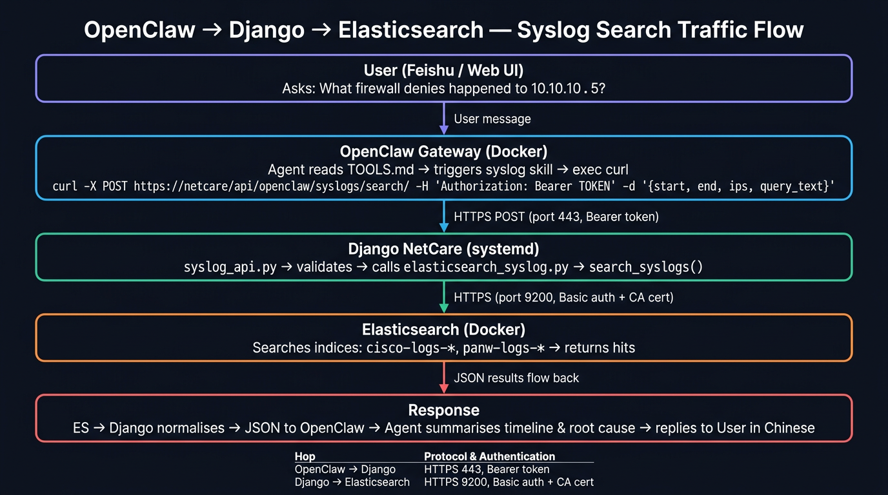

# OpenClaw → Django → Elasticsearch — Syslog Search Integration

> How OpenClaw fetches Cisco / Palo Alto syslogs on demand via the NetCare Django API.

---

## Traffic Flow



```
┌──────────────────────────────────────────────────────────────────┐
│  1. User (Feishu / Web UI)                                       │
│     "What firewall denies happened to 10.10.10.5 in 2 hours?"   │
└──────────────────────────┬───────────────────────────────────────┘
                           │  user message
                           ▼
┌──────────────────────────────────────────────────────────────────┐
│  2. OpenClaw Gateway (Docker)                                    │
│                                                                  │
│  Agent reads TOOLS.md → recognises historical log query          │
│  → triggers syslog skill → uses exec tool to run curl            │
│                                                                  │
│  curl -sS -X POST \                                              │
│    "https://cmhk-it-netcare.com/api/openclaw/syslogs/search/" \ │
│    -H "Authorization: Bearer $OPENCLAW_INTERNAL_TOKEN" \         │
│    -H "Content-Type: application/json" \                         │
│    -d '{"start":"now-2h","end":"now",                            │
│         "query_text":"deny","ips":["10.10.10.5"],"size":50}'    │
└──────────────────────────┬───────────────────────────────────────┘
                           │  HTTPS POST (port 443, Bearer token)
                           ▼
┌──────────────────────────────────────────────────────────────────┐
│  3. Django NetCare (systemd on host)                             │
│                                                                  │
│  syslog_api.py                                                   │
│    → checks Bearer token (401 if invalid)                        │
│    → validates JSON body (start/end required, vendors whitelist) │
│    → calls search_syslogs() from elasticsearch_syslog.py         │
└──────────────────────────┬───────────────────────────────────────┘
                           │  HTTPS (port 9200, Basic auth + CA cert)
                           ▼
┌──────────────────────────────────────────────────────────────────┐
│  4. Elasticsearch (Docker)                                       │
│                                                                  │
│  Searches indices: cisco-logs-*, panw-logs-*                     │
│  Filters: time range, IP, vendor, Lucene query text              │
│  Returns raw hits sorted by @timestamp desc                      │
└──────────────────────────┬───────────────────────────────────────┘
                           │  JSON results flow back
                           ▼
┌──────────────────────────────────────────────────────────────────┐
│  5. Response                                                     │
│                                                                  │
│  ES → Django normalises hits to flat dicts                       │
│  Django → OpenClaw returns JSON with total, count, results[]     │
│  OpenClaw → User: agent summarises timeline & root cause         │
└──────────────────────────────────────────────────────────────────┘
```

---

## Network Hops

| From | To | Protocol | Port | Auth |
|---|---|---|---|---|
| OpenClaw container | Django (host Nginx) | HTTPS | 443 | Bearer token |
| Django (Python) | Elasticsearch container | HTTPS | 9200 | Basic auth + CA cert |

> Elasticsearch credentials never leave Django. OpenClaw only knows the Django API URL and its bearer token.

---

## API Endpoint

```
POST /api/openclaw/syslogs/search/
```

### Request

```json
{
  "start": "now-2h",
  "end": "now",
  "query_text": "deny OR link down",
  "devices": ["core-sw-01", "asa-fw-01"],
  "ips": ["10.10.10.5"],
  "vendors": ["cisco", "panw"],
  "size": 50
}
```

| Field | Required | Description |
|---|---|---|
| `start` | Yes | Start of time range (e.g. `now-2h`, `2026-03-20T00:00:00Z`) |
| `end` | Yes | End of time range (e.g. `now`) |
| `query_text` | No | Lucene query string for message/content search |
| `devices` | No | List of device hostnames to match |
| `ips` | No | List of IP addresses to match |
| `vendors` | No | List from `{"cisco", "panw"}` |
| `size` | No | Max results (default 100, max 200) |

### Response

```json
{
  "success": true,
  "total": 42,
  "count": 42,
  "elapsed_ms": 127,
  "results": [
    {
      "timestamp": "2026-03-20T08:30:00Z",
      "message": "Deny ip src outside:10.10.10.5 ...",
      "vendor": "cisco",
      "dataset": "cisco.asa",
      "device": "asa-fw-01",
      "device_ip": "10.10.10.254",
      "source_ip": "10.10.10.5",
      "severity": "warning",
      "index": "cisco-logs-2026.03.20",
      "id": "abc123"
    }
  ]
}
```

---

## Files

| File | Purpose |
|---|---|
| `auto_tickets/services/elasticsearch_syslog.py` | Elasticsearch client, query builder, result normalisation |
| `auto_tickets/views/syslog_api.py` | Django API view with Bearer token auth and input validation |
| `network_tickets/urls.py` | Route: `api/openclaw/syslogs/search/` |
| `network_tickets/settings.py` | `ELASTIC_*` and `OPENCLAW_INTERNAL_TOKEN` settings |
| `env.conf` | Environment variables for Elasticsearch URL, credentials, CA cert, token |

---

## Configuration (env.conf)

```bash
ELASTIC_URL=https://elasticsearch.qytopensource.com:9200
ELASTIC_USERNAME=elastic
ELASTIC_PASSWORD=****
ELASTIC_CA_CERT=/it_network/open_source_software_3_EFK_NetFlow/certs/ca.cer
ELASTIC_INDEX_PATTERN=network-logs-*,cisco-logs-*,panw-logs-*
ELASTIC_MAX_RESULTS=200
OPENCLAW_INTERNAL_TOKEN=netcare-openclaw-syslog-2026
```

---

## Elasticsearch Index Patterns

These are set by the Filebeat TLS config (`filebeat-tls.yml`):

| Vendor / Module | Index Pattern | Syslog Port (container) | Host Port |
|---|---|---|---|
| Cisco ASA | `cisco-logs-*` | 9001 | 514/udp |
| Cisco IOS / IOS-XE | `cisco-logs-*` | 9002 | 5140/udp |
| Cisco Nexus | `cisco-logs-*` | 9506 | 5141/udp |
| Palo Alto PAN-OS | `panw-logs-*` | 9510 | 5142/udp |

All Cisco variants share one index pattern (`cisco-logs-*`). Use `event.dataset` to distinguish: `cisco.asa`, `cisco.ios`, `cisco.nexus`.

---

## When To Use Syslog Search vs pyATS

| Scenario | Use |
|---|---|
| Past incident analysis | **Syslog search** (Elasticsearch) |
| Cross-device log correlation | **Syslog search** |
| Firewall deny history | **Syslog search** |
| Timeline reconstruction | **Syslog search** |
| Current interface state | **pyATS** |
| Current routing / config | **pyATS** |
| Live ping test | **pyATS** |
| Device-local recent logs | **pyATS** (`show logging`) |

---

## OpenClaw curl Command (for SKILL.md / TOOLS.md)

```bash
curl -sS -X POST "https://cmhk-it-netcare.com/api/openclaw/syslogs/search/" \
  -H "Authorization: Bearer $OPENCLAW_INTERNAL_TOKEN" \
  -H "Content-Type: application/json" \
  -d '{
    "start": "now-2h",
    "end": "now",
    "query_text": "BGP OR OSPF OR deny OR link down",
    "devices": ["core-sw-01"],
    "vendors": ["cisco", "panw"],
    "size": 50
  }'
```

---

## Deployment Checklist

See [pending_tasks.md](pending_tasks.md) for the full step-by-step deployment guide.
